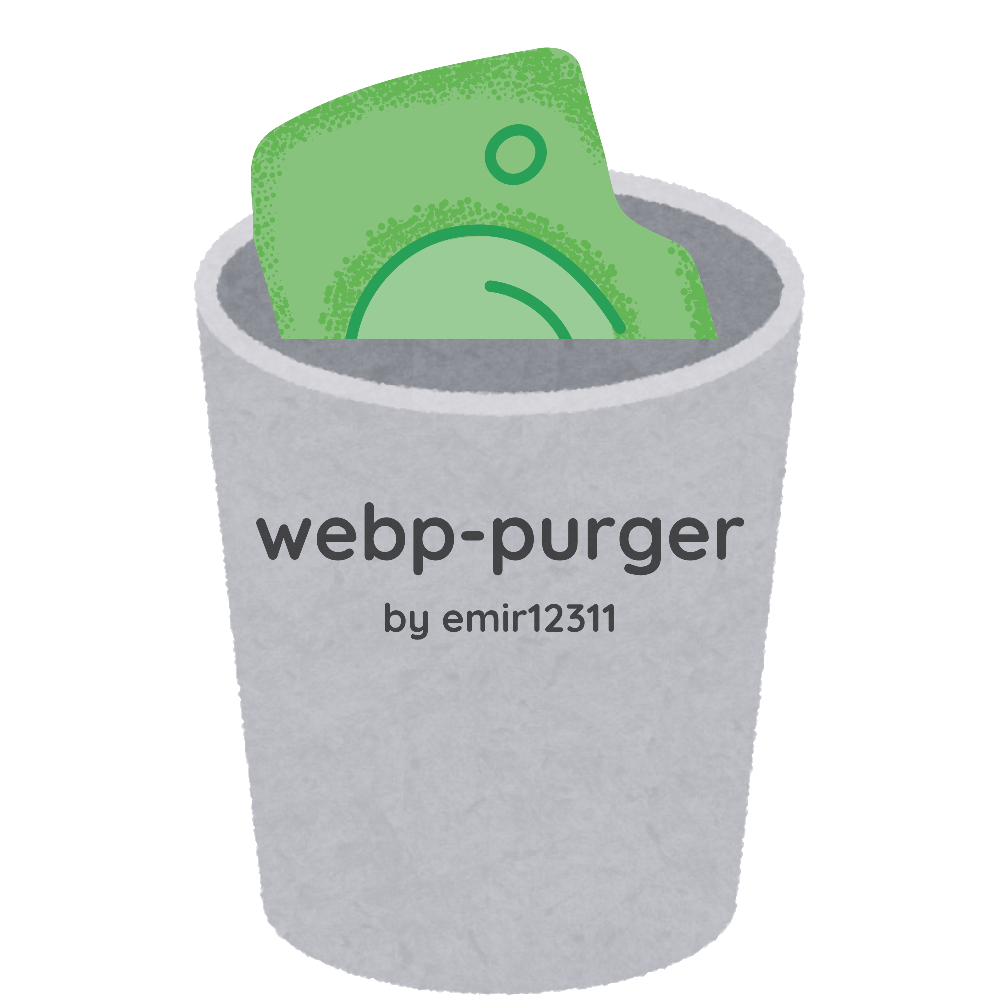

<div align="center">

[](https://github.com/emir12311/webp-purger/stargazers)
[](https://github.com/emir12311/webp-purger/issues)
[](https://www.gnu.org/licenses/gpl-3.0.html)

<br>



<br>

<h1>webp-purger</h1>

<p>A CLI to deal with all your WebP troubles.</p>

</div>

## What is webp-purger?

`webp-purger` is a CLI tool that walks through a path you give it and converts every valid `.webp` file it finds.

## Why is webp-purger?

If you've ever been searching for photos to use in your slideshows and kept downloading WebP files, you'd know my pain.

That's why I built this tool.

## How is webp-purger?

It was a nice project to work on, and I got a ton of learning experience from it.

If you want to see how it works internally, check out the [How It Works](#how-it-works) section.

## When is webp-purger?

I was able to finish the project in around 5 days.

Updates may come in the future.

## Installation

You can get the executable from the [Releases](https://github.com/emir12311/webp-purger/releases) page, or you can build it yourself.

### Requirements

* [libwebp](https://developers.google.com/speed/webp)
* [libpng](http://www.libpng.org/pub/png/libpng.html)
* Clang
* Git

### Build from source

```bash
git clone https://github.com/emir12311/webp-purger
cd webp-purger
make
```

This will create a `webp-purger` executable.

You can move it somewhere in your `PATH`, or use it directly:

```bash
./webp-purger
```

To remove the object files after building:

```bash
make clean
```

## Usage

The usage is pretty simple.

```bash
webp-purger <path_to_directory>
```

### Options

| Flag               | Description                                        |
| ------------------ | -------------------------------------------------- |
| `--force`          | Don't prompt on failed files.                      |
| `--include-hidden` | Include files and directories that start with `.`. |
| `--verbose`        | Show full errors for file errors.                  |

## How It Works

The tool takes the path you give it and calls `walk()` on it.

1. The given directory is opened.
2. The files and directories inside it are read and looped through.
3. If an entry is another directory, `walk()` is called on it again.
4. If an entry is a file, `webp-purger` checks whether it is a WebP image.
5. If it is a WebP image, it is converted to PNG.
6. If the conversion succeeds, the original WebP file is moved to `.webptrashed` in your home directory.

In short:

```text
Directory
    │
    ├── Directory ──→ walk() ──→ ...
    │
    └── File
         │
         ├── WebP ──→ Convert ──→ PNG
         │                    │
         │                    └── Original → ~/.webptrashed
         │
         └── Not WebP ──→ Ignore
```

That's basically it.

## License

This project is licensed under the **GNU General Public License v3.0**.

See the [GNU GPL v3](https://www.gnu.org/licenses/gpl-3.0.html) for the full license text.
